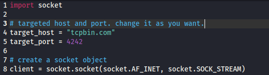
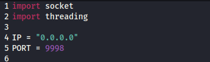
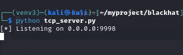
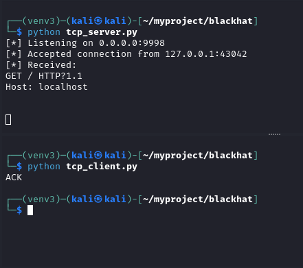

# Python Network Essentials: Implementations from Black Hat Python

## Description

This repository contains basic networking scripts inspired by the *Black Hat Python* curriculum. These tools demonstrate how Python can be used to interact with network protocols at a low level.

By moving away from high-level libraries and interacting directly with the TCP/UDP stacks, these scripts demonstrate how data is encapsulated, transmitted, and received across a network.


## Installation

#### 1. Clone the repository:
```bash
git clone https://github.com/ahsan1279/python-networking.git
cd python-networking
```
#### 2. Create a Virtual Environment:
It is recommended to use a Python virtual environment to keep this project's execution isolated from your global system. This is just to maintain the good practice.

```bash
python3 -m venv venv
```
#### 3. Activate the Environment:
*On Linux/macOS:*

```bash
source venv/bin/activate
```
*On Windows:*

```bash
.\venv\Scripts\activate
```

## Usage
We are gonna use *python* command for running the project in the virtual environment.
If you have not activated the virtual environment as instructed above, then use the *python3* command.

#### TCP Client:
The target_host variable states the host IP or domain and target_port states the port where we are sending requests. In this case tcpbin.com:4242 is used because it simply sends back the request as the response like echo. It is great for testing network tools.



You can change it as you want.

run the command:
```bash
python tcp_client.py
```
A simple GET request will be sent to the server. if sending the request is successful and the server is up.
You will observer the response getting back from the targeted host server.


#### UDP Client:
There is actually not much to see from the clientss perspective since it is a UDP client.
The target_host and target_port variables can be changed here.
If you own the target host you will see the requests. 

Run the command:
```bash
python udp_client.py
```
A simple GET request will be sent to the server. if sending the request is successful and the server is up.
You will receive the response from the targeted host server.


#### TCP Server:

The IP variable states the listening servers IP and the PORT variable is which the server will be listening through.



Run the command to start listening:
```bash
python tcp_server.py
```
The server is listening now.



To test if the server is actually listening, I am gonna use the tcp_client.py as the request sending client here .
First, replace the target_host with *localhost , 0.0.0.0* or *127.0.0.1* , replace the target_port with the value of PORT from tcp_server.py and run it in a different terminal. make sure the tcp server is already running.
The 3 way handshake can be seen here.




## Wrapping Up

This is my first python project uploaded in GitHub. Humble request to reach out for any suggestion. Thank you.
